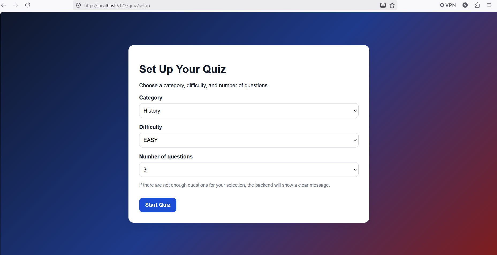
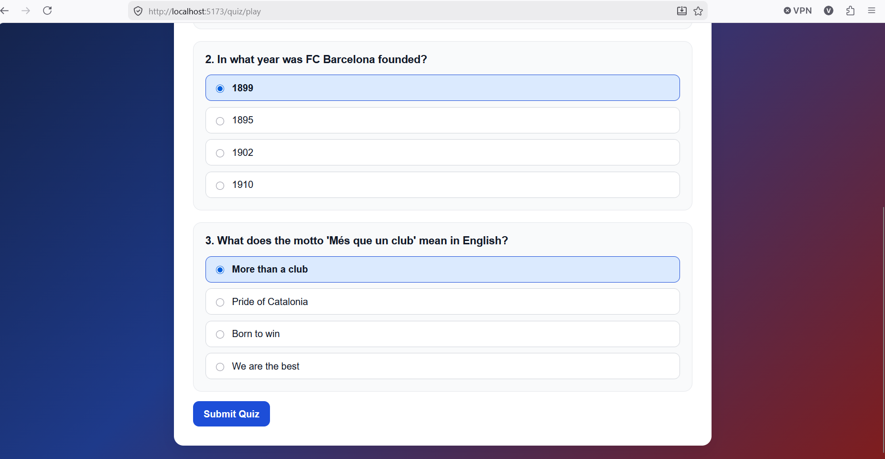
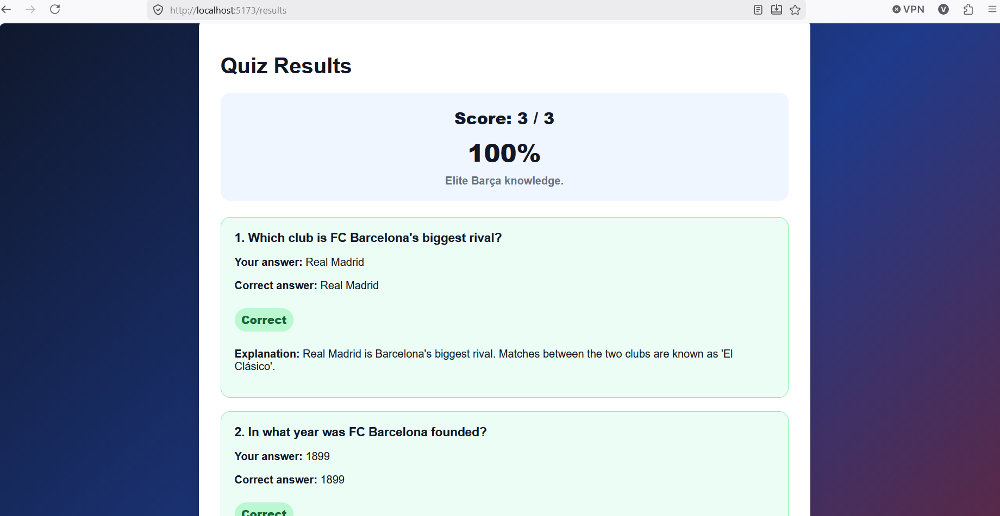
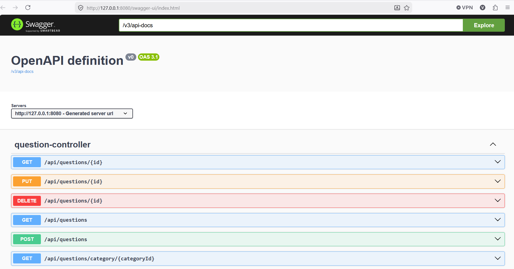

# BlaugranaQuiz

BlaugranaQuiz is a full-stack FC Barcelona trivia application built with **Spring Boot**, **PostgreSQL**, **React**, and **TypeScript**.

Users can choose a quiz category, difficulty, and number of questions, play a multiple-choice quiz, submit answers, and review their score with correct answers and explanations.

The project was built as a portfolio application to practice Java/Spring Boot backend development, REST API design, PostgreSQL persistence, React frontend development, TypeScript, and full-stack integration.

---

## Screenshots

> Add screenshots to the `screenshots` folder using the exact file names below.

### Home Page


### Quiz Setup



### Quiz Page



### Results Page



### Swagger API Documentation



---

## Features

### Public Quiz Flow

- Load quiz categories from the backend
- Choose category, difficulty, and number of questions
- Start a quiz with randomly selected questions
- Display answer options without exposing the correct answer
- Select answers and track quiz progress
- Submit all answers at once
- Calculate score and percentage
- Show correct and wrong answers
- Show answer explanations after submission
- Persist quiz questions, selected answers, and results in local storage so refresh does not break the quiz flow

### Backend Features

- Spring Boot REST API
- PostgreSQL database
- Spring Data JPA / Hibernate
- Category CRUD
- Question CRUD with answer options
- Difficulty-based quiz generation
- Quiz submission and scoring
- Global exception handling
- Request validation
- Seed data for initial quiz content
- Swagger/OpenAPI documentation
- CORS configuration for React frontend
- Environment variables for database configuration

### Frontend Features

- React + TypeScript frontend
- Vite development setup
- React Router navigation
- Axios API integration
- Quiz setup page
- Quiz play page
- Results page
- Reusable layout components
- Error and loading states
- Local storage persistence
- Basic responsive UI

---

## Tech Stack

### Backend

- Java 21
- Spring Boot
- Spring Web
- Spring Data JPA
- Hibernate
- PostgreSQL
- Bean Validation
- Swagger/OpenAPI
- Maven

### Frontend

- React
- TypeScript
- Vite
- React Router
- Axios
- CSS

### Tools

- IntelliJ IDEA
- Visual Studio Code
- pgAdmin
- Git
- GitHub

---

## Project Structure

```text
BlaugranaQuiz
├── backend
│   ├── .mvn
│   ├── requests
│   ├── src
│   │   ├── main
│   │   └── test
│   ├── pom.xml
│   ├── mvnw
│   └── mvnw.cmd
│
├── frontend
│   ├── public
│   ├── src
│   │   ├── api
│   │   ├── components
│   │   ├── pages
│   │   ├── types
│   │   └── utils
│   ├── package.json
│   ├── index.html
│   └── vite.config.ts
│
├── screenshots
├── .gitignore
└── README.md
```

---

## Backend Setup

### 1. Create PostgreSQL Database

Create a PostgreSQL database named:

```sql
CREATE DATABASE blaugrana_quiz_db;
```

You can also create it manually through pgAdmin.

---

### 2. Configure Environment Variables

The backend uses environment variables for database configuration.

Set these variables in IntelliJ Run Configuration, your terminal, or your system environment:

```env
DB_URL=jdbc:postgresql://localhost:5432/blaugrana_quiz_db
DB_USERNAME=postgres
DB_PASSWORD=your_postgres_password
```

The backend `application.properties` should not contain a real database password.

Example configuration:

```properties
spring.datasource.url=${DB_URL:jdbc:postgresql://localhost:5432/blaugrana_quiz_db}
spring.datasource.username=${DB_USERNAME:postgres}
spring.datasource.password=${DB_PASSWORD:postgres}
```

---

### 3. Run Backend

From the project root:

```bash
cd backend
```

Run with Maven wrapper:

```bash
./mvnw spring-boot:run
```

On Windows:

```bash
mvnw.cmd spring-boot:run
```

The backend runs on:

```text
http://localhost:8080
```

---

### 4. Swagger Documentation

After starting the backend, Swagger UI is available at:

```text
http://localhost:8080/swagger-ui/index.html
```

Swagger can be used to test the backend endpoints directly from the browser.

---

## Frontend Setup

### 1. Install Dependencies

From the project root:

```bash
cd frontend
npm install
```

---

### 2. Configure Environment Variables

Create a `.env` file inside the `frontend` folder:

```env
VITE_API_BASE_URL=http://127.0.0.1:8080/api
```

Also include an example file:

```text
frontend/.env.example
```

Example content:

```env
VITE_API_BASE_URL=http://127.0.0.1:8080/api
```

Do not commit the real `.env` file.

---

### 3. Run Frontend

From the `frontend` folder:

```bash
npm run dev
```

The frontend runs on:

```text
http://localhost:5173
```

---

## Main API Endpoints

### Categories

```http
GET    /api/categories
GET    /api/categories/{id}
POST   /api/categories
PUT    /api/categories/{id}
DELETE /api/categories/{id}
```

### Questions

```http
GET    /api/questions
GET    /api/questions/{id}
GET    /api/questions/category/{categoryId}
POST   /api/questions
PUT    /api/questions/{id}
DELETE /api/questions/{id}
```

### Quiz

```http
POST /api/quizzes/start
POST /api/quizzes/submit
```

---

## Quiz Flow

### 1. Start Quiz

Request:

```http
POST /api/quizzes/start
Content-Type: application/json
```

Example body:

```json
{
  "categoryId": 1,
  "difficulty": "EASY",
  "numberOfQuestions": 3
}
```

Example response:

```json
{
  "questions": [
    {
      "id": 1,
      "text": "Who was Barcelona's manager during the 2008/09 treble-winning season?",
      "difficulty": "EASY",
      "answerOptions": [
        {
          "id": 1,
          "text": "Pep Guardiola"
        },
        {
          "id": 2,
          "text": "Frank Rijkaard"
        }
      ]
    }
  ]
}
```

The quiz start response intentionally does **not** expose which answer is correct.

---

### 2. Submit Quiz

Request:

```http
POST /api/quizzes/submit
Content-Type: application/json
```

Example body:

```json
{
  "answers": [
    {
      "questionId": 1,
      "selectedAnswerOptionId": 1
    },
    {
      "questionId": 2,
      "selectedAnswerOptionId": 6
    },
    {
      "questionId": 3,
      "selectedAnswerOptionId": 10
    }
  ]
}
```

Example response:

```json
{
  "score": 2,
  "totalQuestions": 3,
  "percentage": 66.67,
  "results": [
    {
      "questionId": 1,
      "questionText": "Who was Barcelona's manager during the 2008/09 treble-winning season?",
      "selectedAnswer": "Pep Guardiola",
      "correctAnswer": "Pep Guardiola",
      "correct": true,
      "explanation": "Pep Guardiola led Barcelona to the treble in his first season as first-team manager."
    }
  ]
}
```

---

## Error Handling

The backend returns consistent error responses.

Example:

```json
{
  "status": 400,
  "message": "Not enough questions available for the requested quiz.",
  "timestamp": "2026-05-22T14:30:00"
}
```

Handled cases include:

- Category not found
- Question not found
- Duplicate category
- Invalid request body
- Not enough questions for selected quiz options
- Selected answer option does not belong to the submitted question
- Duplicate question submissions

---

## Local Storage Usage

The frontend uses local storage to persist temporary quiz state:

- Started quiz questions
- Selected answers
- Quiz result

This allows the user to refresh `/quiz/play` or `/results` without losing the current quiz state.

This is temporary client-side persistence. Future versions can move completed score storage to the backend.

---

## Current Status

The current version supports the full public quiz flow:

```text
Choose category and difficulty
Start quiz
Answer questions
Submit quiz
Review score and explanations
```

Authentication and score storage are planned next.

---

## Planned Features

### JWT Authentication

Planned authentication features:

- User registration
- User login
- JWT token generation
- Protected user endpoints
- Authenticated frontend state
- Logout functionality

### Score Storage

Instead of storing every finished quiz in full detail, the next version will store score summaries for logged-in users.

Possible `Score` entity:

```text
Score
- id
- user_id
- category_id
- difficulty
- score
- total_questions
- percentage
- completed_at
```

This allows user score tracking without storing every selected answer.

### Leaderboards

Leaderboards should be grouped by:

```text
category + difficulty
```

Example:

```text
Players - EASY
Players - MEDIUM
Players - HARD
Players - EXPERT
Club History - EASY
Club History - MEDIUM
Club History - HARD
Club History - EXPERT
```

This prevents EASY scores and EXPERT scores from being compared unfairly.

Possible leaderboard fields:

```text
Rank
Username
Category
Difficulty
Score
Total Questions
Percentage
Completed At
```

### Admin Features

Future admin features:

- Admin-only category management
- Admin-only question management
- Role-based authorization
- Admin frontend dashboard

### Deployment

Future deployment improvements:

- Docker support
- Backend deployment
- Frontend deployment
- Production database configuration

---

## Future Development Plan

Recommended next phases:

```text
1. Add JWT authentication
2. Add user registration and login frontend pages
3. Store score summaries for logged-in users
4. Add personal scores page
5. Add leaderboard grouped by category and difficulty
6. Add admin role protection
7. Add admin question/category management UI
8. Add Docker and deployment configuration
```

---

## Author

Vladimir Gogovski

GitHub: [Gogovski20](https://github.com/Gogovski20)

LinkedIn: https://www.linkedin.com/in/vladimir-gogovski