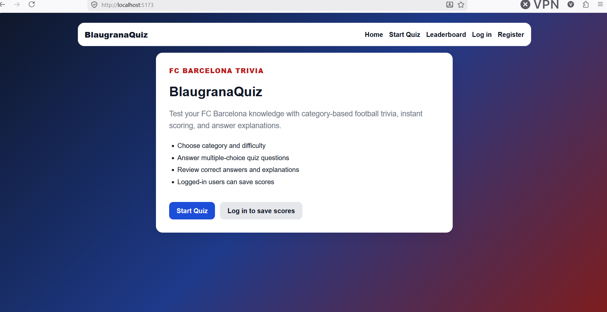
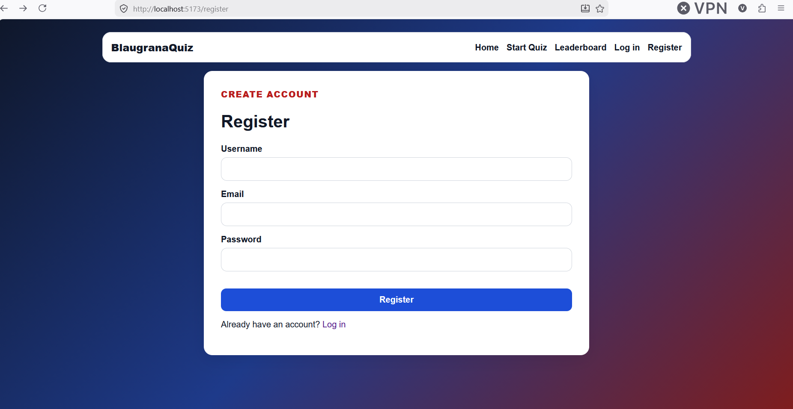
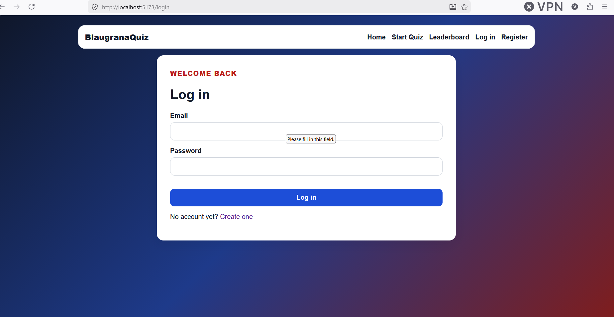
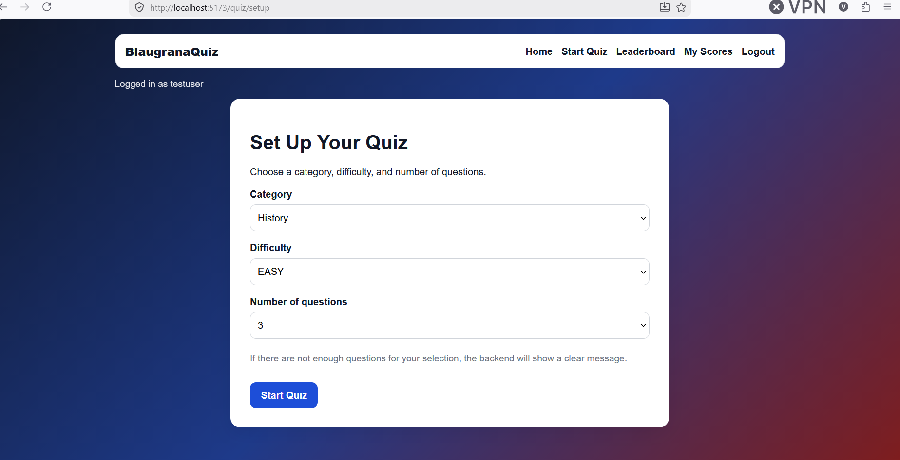
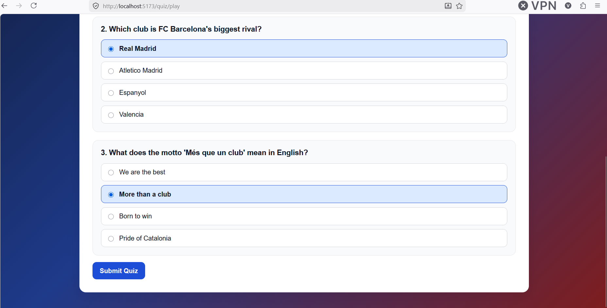
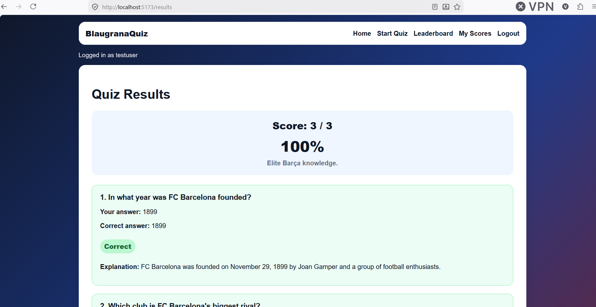
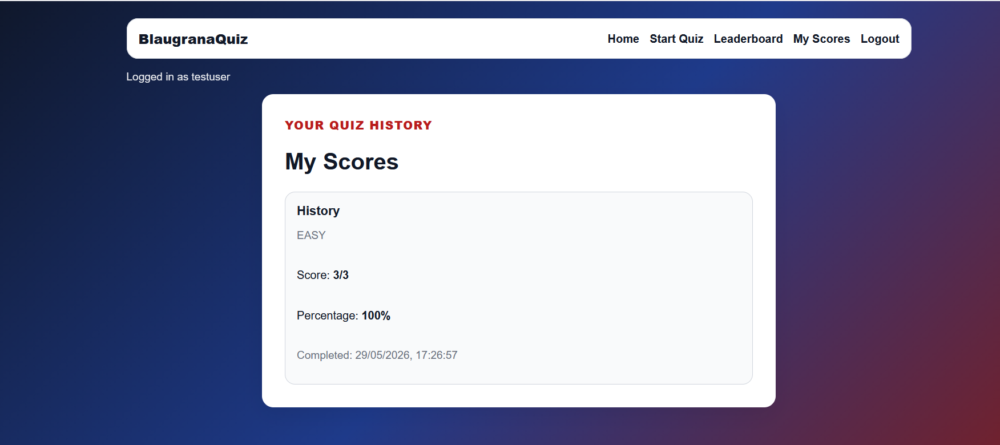
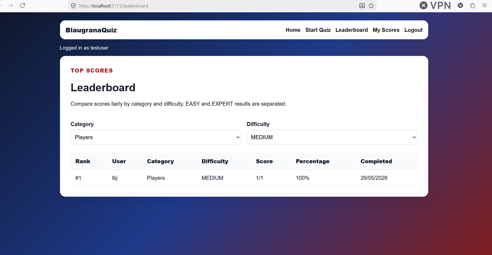

# BlaugranaQuiz

BlaugranaQuiz is a full-stack FC Barcelona trivia application built with **Spring Boot**, **PostgreSQL**, **React**, and **TypeScript**.

Users can register, log in, choose a quiz category, difficulty, and number of questions, play a multiple-choice quiz, submit answers, review their score with correct answers and explanations, save completed scores, and compare results through a leaderboard grouped by category and difficulty.

The project was built as a portfolio application to practice Java/Spring Boot backend development, REST API design, PostgreSQL persistence, JWT authentication, React frontend development, TypeScript, and full-stack integration.

---

## Screenshots

### Home Page



### Register Page



### Login Page



### Quiz Setup



### Quiz Page



### Results Page



### My Scores Page



### Leaderboard Page



### Swagger API Documentation


---


## Features

### Public Quiz Flow

- Load quiz categories from the backend
- Choose category, difficulty, and number of questions
- Start a quiz with randomly selected questions
- Display answer options without exposing the correct answer
- Select answers and track quiz progress
- Submit all answers at once
- Calculate score and percentage
- Show correct and wrong answers
- Show answer explanations after submission
- Persist quiz questions, selected answers, and results in local storage so refresh does not break the quiz flow
- Allow guest users to play quizzes without an account

### Authentication and Authorization

- User registration
- User login
- JWT token generation
- Password hashing with BCrypt
- Authenticated frontend state
- Persistent login using local storage
- Automatic JWT attachment with Axios interceptors
- Logout functionality
- Protected user endpoints
- Role-based authorization with `USER` and `ADMIN` roles
- Admin-only access for category and question management endpoints

### Score Tracking

- Save score summaries for logged-in users
- Guest users can play quizzes, but scores are not saved
- Store score summary instead of full answer history
- Personal score history page for authenticated users
- Score records include:
  - User
  - Category
  - Difficulty
  - Score
  - Total questions
  - Percentage
  - Completion time

### Leaderboards

- Public leaderboard page
- Leaderboards grouped by category and difficulty
- Top scores ranked fairly within the same quiz type
- Ranking ordered by:
  - Higher percentage
  - Higher score
  - Earlier completion time
- Category and difficulty filters

### Backend Features

- Spring Boot REST API
- PostgreSQL database
- Spring Data JPA / Hibernate
- Category CRUD
- Question CRUD with answer options
- Difficulty-based quiz generation
- Quiz submission and scoring
- JWT authentication
- BCrypt password hashing
- Role-based endpoint protection
- Score storage for authenticated users
- Personal score retrieval
- Category/difficulty-based leaderboard retrieval
- Global exception handling
- Request validation
- Seed data for initial quiz content
- Swagger/OpenAPI documentation
- Swagger JWT authorization support
- CORS configuration for React frontend
- Environment variables for database configuration

### Frontend Features

- React + TypeScript frontend
- Vite development setup
- React Router navigation
- Axios API integration
- Shared Axios client with JWT interceptor
- Authentication context/provider
- Register page
- Login page
- Logout functionality
- Global navigation layout
- Quiz setup page
- Quiz play page
- Results page
- My Scores page
- Leaderboard page
- Protected route component
- Reusable layout components
- Error and loading states
- Local storage persistence for quiz flow and auth token
- Responsive UI

---

## Tech Stack

### Backend

- Java 21
- Spring Boot
- Spring Web
- Spring Security
- Spring Data JPA
- Hibernate
- PostgreSQL
- Bean Validation
- JWT
- BCrypt
- Swagger/OpenAPI
- Maven

### Frontend

- React
- TypeScript
- Vite
- React Router
- Axios
- CSS

### Tools

- IntelliJ IDEA
- Visual Studio Code
- pgAdmin
- Git
- GitHub
- Swagger UI

---

## Project Structure

```text
BlaugranaQuiz
├── backend
│   ├── .mvn
│   ├── requests
│   ├── src
│   │   ├── main
│   │   │   ├── java
│   │   │   │   └── com/vladimir/blaugranaquiz
│   │   │   │       ├── config
│   │   │   │       ├── controllers
│   │   │   │       ├── dtos
│   │   │   │       ├── entities
│   │   │   │       ├── exceptions
│   │   │   │       ├── repositories
│   │   │   │       ├── security
│   │   │   │       └── services
│   │   │   └── resources
│   │   └── test
│   ├── pom.xml
│   ├── mvnw
│   └── mvnw.cmd
│
├── frontend
│   ├── public
│   ├── src
│   │   ├── api
│   │   ├── assets
│   │   ├── components
│   │   ├── context
│   │   ├── pages
│   │   ├── types
│   │   └── utils
│   ├── package.json
│   ├── index.html
│   └── vite.config.ts
│
├── screenshots
├── .gitignore
└── README.md
```

---

## Backend Setup

### 1. Create PostgreSQL Database

Create a PostgreSQL database named:

```sql
CREATE DATABASE blaugrana_quiz_db;
```

You can also create it manually through pgAdmin.

---

### 2. Configure Environment Variables

The backend uses environment variables for database configuration.

Set these variables in IntelliJ Run Configuration, your terminal, or your system environment:

```env
DB_URL=jdbc:postgresql://localhost:5432/blaugrana_quiz_db
DB_USERNAME=postgres
DB_PASSWORD=your_postgres_password
```

The backend `application.properties` should not contain a real database password.

Example configuration:

```properties
spring.datasource.url=${DB_URL:jdbc:postgresql://localhost:5432/blaugrana_quiz_db}
spring.datasource.username=${DB_USERNAME:postgres}
spring.datasource.password=${DB_PASSWORD:postgres}
```

---

### 3. Run Backend

From the project root:

```bash
cd backend
```

Run with Maven wrapper:

```bash
./mvnw spring-boot:run
```

On Windows:

```bash
mvnw.cmd spring-boot:run
```

The backend runs on:

```text
http://localhost:8080
```

---

### 4. Swagger Documentation

After starting the backend, Swagger UI is available at:

```text
http://localhost:8080/swagger-ui/index.html
```

Swagger can be used to test the backend endpoints directly from the browser.

---

## Frontend Setup

### 1. Install Dependencies

From the project root:

```bash
cd frontend
npm install
```

---

### 2. Configure Environment Variables

Create a `.env` file inside the `frontend` folder:

```env
VITE_API_BASE_URL=http://127.0.0.1:8080/api
```

Also include an example file:

```text
frontend/.env.example
```

Example content:

```env
VITE_API_BASE_URL=http://127.0.0.1:8080/api
```

Do not commit the real `.env` file.

---

### 3. Run Frontend

From the `frontend` folder:

```bash
npm run dev
```

The frontend runs on:

```text
http://localhost:5173
```

---

## Main API Endpoints

### Authentication

```http
POST /api/auth/register
POST /api/auth/login
GET  /api/auth/me
```

### Categories

```http
GET    /api/categories
GET    /api/categories/{id}
POST   /api/categories
PUT    /api/categories/{id}
DELETE /api/categories/{id}
```

### Questions

```http
GET    /api/questions
GET    /api/questions/{id}
GET    /api/questions/category/{categoryId}
POST   /api/questions
PUT    /api/questions/{id}
DELETE /api/questions/{id}
```

### Quiz

```http
POST /api/quizzes/start
POST /api/quizzes/submit
```

### Scores

```http
GET /api/scores/me
GET /api/scores/leaderboard?categoryId={categoryId}&difficulty={difficulty}
```

---

## Authentication Flow

### 1. Register

Request:

```http
POST /api/auth/register
Content-Type: application/json
```

Example body:

```json
{
  "username": "test",
  "email": "test@example.com",
  "password": "Test123!"
}
```

Example response:

```json
{
  "userId": 1,
  "username": "test",
  "email": "test@example.com",
  "role": "USER",
  "message": "Registration successful. Please log in."
}
```

Registration creates a new user account, but it does **not** return a JWT token. The user must log in after registration.

---

### 2. Login

Request:

```http
POST /api/auth/login
Content-Type: application/json
```

Example body:

```json
{
  "email": "test@example.com",
  "password": "Test123!"
}
```

Example response:

```json
{
  "token": "eyJhbGciOiJIUzI1NiJ9...",
  "userId": 1,
  "username": "test",
  "email": "test@example.com",
  "role": "USER"
}
```

The frontend stores the JWT token in local storage and automatically sends it with protected requests using an Axios interceptor.

---

### 3. Current User

Request:

```http
GET /api/auth/me
Authorization: Bearer JWT_TOKEN
```

Example response:

```json
{
  "id": 1,
  "username": "test",
  "email": "test@example.com",
  "role": "USER"
}
```

This endpoint is used to restore authenticated frontend state after page refresh.

---

## Quiz Flow

### 1. Start Quiz

Request:

```http
POST /api/quizzes/start
Content-Type: application/json
```

Example body:

```json
{
  "categoryId": 1,
  "difficulty": "EASY",
  "numberOfQuestions": 3
}
```

Example response:

```json
{
  "questions": [
    {
      "id": 1,
      "text": "Who was Barcelona's manager during the 2008/09 treble-winning season?",
      "difficulty": "EASY",
      "answerOptions": [
        {
          "id": 1,
          "text": "Pep Guardiola"
        },
        {
          "id": 2,
          "text": "Frank Rijkaard"
        }
      ]
    }
  ]
}
```

The quiz start response intentionally does **not** expose which answer is correct.

---

### 2. Submit Quiz

Request:

```http
POST /api/quizzes/submit
Content-Type: application/json
```

Example body:

```json
{
  "answers": [
    {
      "questionId": 1,
      "selectedAnswerOptionId": 1
    },
    {
      "questionId": 2,
      "selectedAnswerOptionId": 6
    },
    {
      "questionId": 3,
      "selectedAnswerOptionId": 10
    }
  ]
}
```

Example response:

```json
{
  "score": 2,
  "totalQuestions": 3,
  "percentage": 66.67,
  "results": [
    {
      "questionId": 1,
      "questionText": "Who was Barcelona's manager during the 2008/09 treble-winning season?",
      "selectedAnswer": "Pep Guardiola",
      "correctAnswer": "Pep Guardiola",
      "correct": true,
      "explanation": "Pep Guardiola led Barcelona to the treble in his first season as first-team manager."
    }
  ]
}
```

If the user is authenticated, the backend saves a score summary after quiz submission.

If the user is not authenticated, the quiz result is returned normally, but no score is saved.

---

## Score Tracking

The backend stores score summaries for logged-in users.

Instead of storing every selected answer, the app stores only the final quiz summary:

```text
Score
- id
- user_id
- category_id
- difficulty
- score
- total_questions
- percentage
- completed_at
```

This keeps the score history lightweight while still supporting personal score tracking and leaderboards.

---

### My Scores

Request:

```http
GET /api/scores/me
Authorization: Bearer JWT_TOKEN
```

Example response:

```json
[
  {
    "id": 1,
    "username": "test",
    "categoryId": 1,
    "categoryName": "Players",
    "difficulty": "EASY",
    "score": 2,
    "totalQuestions": 3,
    "percentage": 66.67,
    "completedAt": "2026-05-28T14:30:00"
  }
]
```

This endpoint is protected and returns only the scores of the currently logged-in user.

---

## Leaderboard

Leaderboards are grouped by:

```text
category + difficulty
```

Example groups:

```text
Players - EASY
Players - MEDIUM
Players - HARD
Players - EXPERT
Club History - EASY
Club History - MEDIUM
Club History - HARD
Club History - EXPERT
```

This prevents easy quiz scores and expert quiz scores from being compared unfairly.

Request:

```http
GET /api/scores/leaderboard?categoryId=1&difficulty=EASY
```

Example response:

```json
[
  {
    "rank": 1,
    "username": "test",
    "categoryName": "Players",
    "difficulty": "EASY",
    "score": 3,
    "totalQuestions": 3,
    "percentage": 100.0,
    "completedAt": "2026-05-28T14:35:00"
  }
]
```

Ranking order:

```text
1. Higher percentage
2. Higher score
3. Earlier completion time
```

The leaderboard endpoint is public, so both guests and logged-in users can view it.

---

## Error Handling

The backend returns consistent error responses.

Example:

```json
{
  "status": 400,
  "message": "Not enough questions available for the requested quiz.",
  "timestamp": "2026-05-22T14:30:00"
}
```

Handled cases include:

- Category not found
- Question not found
- Duplicate category
- Invalid request body
- Invalid email or password
- Username already taken
- Email already registered
- Not enough questions for selected quiz options
- Selected answer option does not belong to the submitted question
- Duplicate question submissions
- Submitted questions from different categories
- Submitted questions with different difficulties
- Unauthorized access to protected endpoints
- Forbidden access to admin-only endpoints

---

## Local Storage Usage

The frontend uses local storage to persist temporary quiz and authentication state:

- JWT token
- Started quiz questions
- Selected answers
- Quiz result

This allows the user to:

- Stay logged in after refreshing the page
- Refresh `/quiz/play` without losing the current quiz
- Refresh `/results` without losing the latest quiz result

Completed score summaries are stored in the backend for authenticated users.

---

## Current Status

The current version supports:

```text
Register
Login
Logout
JWT-authenticated frontend state
Role-based backend authorization
Admin-protected category/question management
Choose category and difficulty
Start quiz
Answer questions
Submit quiz
Review score and explanations
Save scores for logged-in users
View personal score history
View public leaderboards grouped by category and difficulty
```

---

## Planned Features

### Admin Dashboard

Backend role-based authorization is already implemented, and category/question management endpoints are admin-protected.

Future admin frontend features:

- Admin-only dashboard
- Admin category management UI
- Admin question management UI
- Role-aware frontend navigation

### Profile Improvements

Possible user profile improvements:

- Profile page for logged-in users
- Basic user statistics
- Best score by category
- Total quizzes completed
- Average score percentage

### Score Filtering

Possible score page improvements:

- Filter personal scores by category
- Filter personal scores by difficulty
- Sort by newest, best score, or highest percentage

### Deployment

Future deployment improvements:

- Docker support
- Backend deployment
- Frontend deployment
- Production database configuration
- Production environment variables

---

## Future Development Plan

Recommended next phases:

```text
1. Add admin dashboard UI
2. Add admin category management UI
3. Add admin question management UI
4. Improve My Scores filtering and sorting
5. Add user profile/statistics page
6. Add Docker configuration
7. Deploy backend
8. Deploy frontend
9. Configure production PostgreSQL database
10. Add automated backend and frontend tests
```

---

## Author

Vladimir Gogovski

GitHub: [Gogovski20](https://github.com/Gogovski20)

LinkedIn: https://www.linkedin.com/in/vladimir-gogovski